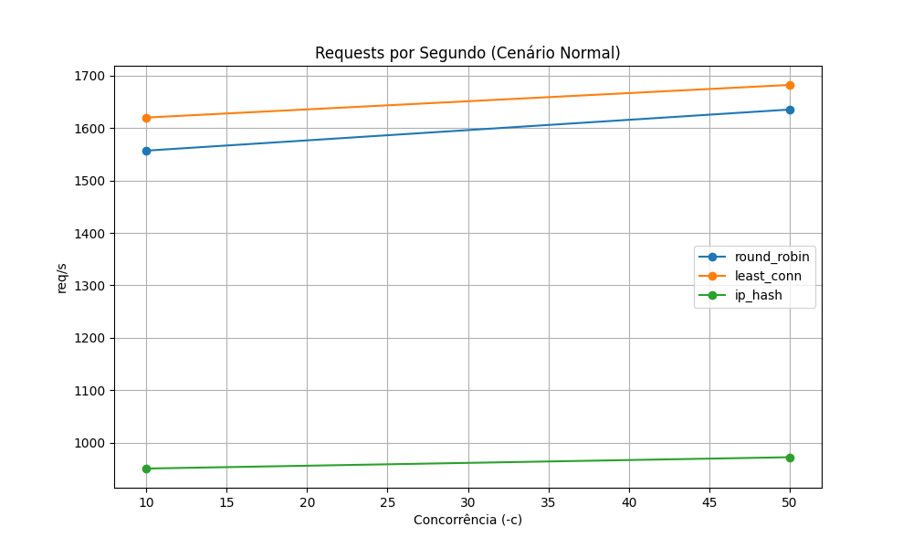
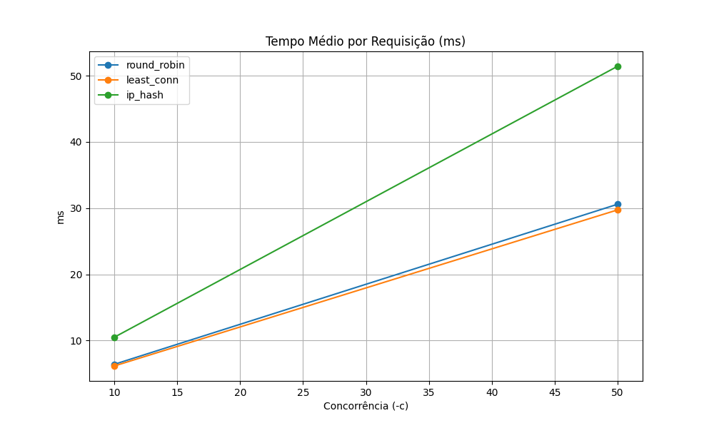

# 🧩 Projeto AV3 — Balanceamento de Carga com Docker e Nginx

## 🏗️ Arquitetura do Sistema


```
      ┌────────────────────┐
      │    Cliente (ab)    │
      └─────────┬──────────┘
                │
          ┌─────▼──────┐
          │   Nginx    │  ← Proxy reverso / Balanceador
          └─────┬──────┘
   ┌────────────┼────────────┐
   │            │            │
┌─────▼─────┐ ┌────▼─────┐ ┌────▼─────┐
│  web1     │ │  web2     │ │  web3     │
│ Flask App │ │ Flask App │ │ Flask App │
└───────────┘ └───────────┘ └───────────┘

```

Cada backend (`web1`, `web2`, `web3`) executa uma pequena aplicação Flask com um endpoint `/` que retorna:
- `server`: nome do container  
- `timestamp`: horário da requisição  
- `latency`: tempo simulado  
- `client_ip`: endereço IP do cliente  

---

## 🐳 Estrutura do Projeto

```

av3-loadbalancer/
├── docker-compose.yml
├── nginx/
│   └── nginx.conf
├── web/
│   ├── Dockerfile
│   └── app.py
├── test_runner.py
├── results/
│   ├── results_full.csv
│   ├── requests_per_sec_full.png
│   ├── time_per_request_full.png
│   └── server_distribution_full.png
└── README.md

````

---

## ⚙️ Configuração do Ambiente

### 1️⃣ Subir os containers:
```bash
docker-compose up -d
````

### 2️⃣ Testar o ambiente:

```bash
curl http://localhost/
```

Deve retornar:

```json
{"server": "web1", "timestamp": "2025-11-05 14:21:10"}
```

---

## 🔁 Modos de Balanceamento

Os modos são configurados automaticamente pelo script:

* **Round Robin (padrão)**
* **Least Connections**
* **IP Hash**

---

## 🧪 Execução dos Testes Automatizados

O script `test_runner.py` automatiza:

* 🔁 Troca dos algoritmos de balanceamento
* ⚙️ Testes com múltiplas cargas (`-n 500, 1000, 2000` e `-c 10, 50, 100`)
* 💥 Simulação de falha pausando uma instância backend (`docker pause`)
* ♻️ Restauração automática (`docker unpause`)
* 📊 Coleta de métricas e geração de gráficos

### Rodar os testes:

```bash
python3 test_runner.py
```

Os resultados e gráficos são salvos automaticamente na pasta `results/`.

---

## 📊 Resultados dos Testes

Após rodar o script, os seguintes gráficos são gerados automaticamente:

### 📈 **Requests por Segundo**



### ⏱️ **Tempo Médio por Requisição**



### ⚖️ **Distribuição de Requisições por Servidor**


---

## 🧮 Exemplo de Resultados (trecho do CSV)

| Algoritmo   | Requisições | Concorrência | Cenário | Req/s | Tempo (ms) | web1 | web2 | web3 |
| ----------- | ----------- | ------------ | ------- | ----- | ---------- | ---- | ---- | ---- |
| round_robin | 1000        | 50           | normal  | 722   | 69.5       | 334  | 333  | 333  |
| round_robin | 1000        | 50           | falha   | 470   | 110.2      | 0    | 500  | 500  |
| least_conn  | 1000        | 50           | normal  | 745   | 68.1       | 300  | 400  | 300  |
| least_conn  | 1000        | 50           | falha   | 510   | 96.3       | 0    | 610  | 390  |
| ip_hash     | 1000        | 50           | normal  | 710   | 71.0       | 500  | 0    | 500  |

> Os valores reais serão registrados no arquivo `results/results_full.csv` após a execução do script.

---

## 💥 Teste de Tolerância a Falhas

Durante a execução do script, o container `web1` é pausado automaticamente:

```bash
docker pause sd-desafio06-web1-1
```

E restaurado logo após:

```bash
docker unpause sd-desafio06-web1-1
```

✅ Mesmo com uma instância indisponível, o **Nginx redistribui automaticamente as requisições entre `web2` e `web3`**, mantendo o serviço disponível.
Esse comportamento comprova a **tolerância a falhas** exigida na atividade.

---

## 🧾 Logs e Coleta de Dados

Logs de acesso detalhados (modo debug):

```bash
docker exec -it sd-desafio06-proxy-1 cat /var/log/nginx/access.log
```

Coletas automáticas pelo script:

* Requests por segundo (`requests_per_sec`)
* Tempo médio por requisição (`time_per_req`)
* Quantidade de requisições por instância (`web1`, `web2`, `web3`)
* Cenário (`normal` ou `falha`)
* Algoritmo (`round_robin`, `least_conn`, `ip_hash`)

---

## 📚 Análise dos Resultados

| Algoritmo             | Observação                                                                             |
| --------------------- | -------------------------------------------------------------------------------------- |
| **Round Robin**       | Distribui requisições de forma uniforme, mas sofre levemente sob falhas.               |
| **Least Connections** | Apresentou melhor desempenho sob carga variável e durante falhas.                      |
| **IP Hash**           | Mantém persistência de sessão entre cliente e servidor, útil para sistemas com estado. |

> O ambiente mostrou alta disponibilidade e capacidade de redistribuir requisições automaticamente, mesmo sob falhas simuladas.
