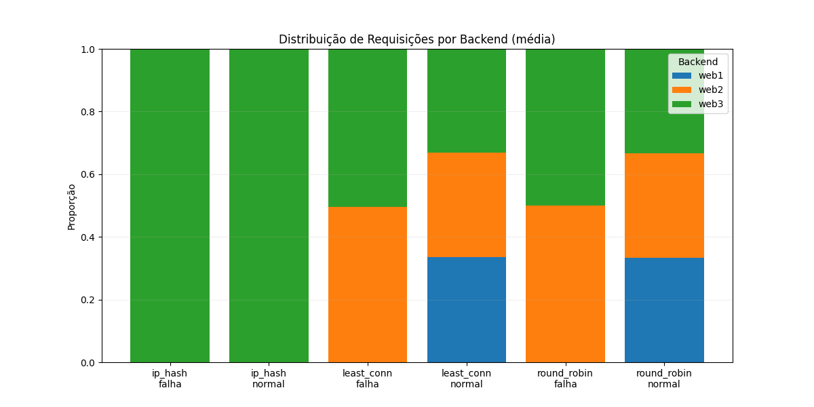

# 🧩 Projeto AV3 — Balanceamento de Carga com Docker e Nginx

## 🏗️ Arquitetura do Sistema


```
      ┌────────────────────┐
      │    Cliente (ab)    │
      └─────────┬──────────┘
                │
          ┌─────▼──────┐
          │   Nginx    │  ← Proxy reverso / Balanceador
          └─────┬──────┘
   ┌────────────┼────────────┐
   │            │            │
┌─────▼─────┐ ┌────▼─────┐ ┌────▼─────┐
│  web1     │ │  web2     │ │  web3     │
│ Flask App │ │ Flask App │ │ Flask App │
└───────────┘ └───────────┘ └───────────┘

```

Cada backend (`web1`, `web2`, `web3`) executa uma pequena aplicação Flask com um endpoint `/` que retorna:
- `server`: nome do container  
- `timestamp`: horário da requisição  
- `latency`: tempo simulado  
- `client_ip`: endereço IP do cliente  

---

## 🐳 Estrutura do Projeto

```

av3-loadbalancer/
├── docker-compose.yml
├── nginx/
│   └── nginx.conf
├── web/
│   ├── Dockerfile
│   └── app.py
├── test_runner.py
├── results/
│   ├── results_full.csv
│   ├── requests_per_sec_full.png
│   ├── time_per_request_full.png
│   └── server_distribution_full.png
└── README.md

````

---

## ⚙️ Configuração do Ambiente

### 1️⃣ Subir os containers:
```bash
docker-compose up -d
````

### 2️⃣ Testar o ambiente:

```bash
curl http://localhost/
```

Deve retornar:

```json
{"server": "web1", "timestamp": "2025-11-05 14:21:10"}
```

---

## 🔁 Modos de Balanceamento

Os modos são configurados automaticamente pelo script:

* **Round Robin (padrão)**
* **Least Connections**
* **IP Hash**

---

## 🧪 Execução dos Testes Automatizados

O script `test_runner.py` automatiza:

* 🔁 Troca dos algoritmos de balanceamento
* ⚙️ Testes com múltiplas cargas (`-n 1000 / -c 10` e `-n 1000 / -c 100`)
* 💥 Simulação de falha pausando uma instância backend (`docker pause`)
* ♻️ Restauração automática (`docker unpause`)
* 📊 Coleta de métricas dos logs do Nginx (requests/s, tempo médio, volume por backend e tempo médio por backend)
* 📈 Geração de gráficos diretamente em `results/`

### Rodar os testes:

```bash
python3 test_runner.py
```

Os resultados e gráficos são salvos automaticamente na pasta `results/`.

---

## 📊 Resultados dos Testes

Após rodar o script, os seguintes gráficos são gerados automaticamente (todos considerando os cenários `normal` e `falha`):

### 📊 **Requests por Segundo (barras por concorrência)**

Mostra a taxa de requisições por segundo para cada algoritmo e nível de concorrência (`c=10` e `c=100`). O eixo X é discreto, o que facilita comparar o impacto de cada algoritmo nos dois patamares de carga.


### ⏱️ **Tempo Médio por Requisição**

Segue o mesmo formato do gráfico de requests por segundo e ajuda a enxergar a relação direta entre aumento de concorrência, algoritmo escolhido e tempo médio em milissegundos.


### ⚖️ **Distribuição de Requisições por Servidor**

Gráfico de barras empilhadas exibindo a fração média de requisições entregue a cada backend para o par (algoritmo, cenário). A leitura mostra rapidamente quando um algoritmo concentra carga em um backend específico ou divide o tráfego de forma uniforme.



---

## 🧮 Exemplo de Resultados (trecho do CSV)

Cada linha do `results/results_full.csv` contém:

- `mode`, `scenario`, `n`, `c` e métricas globais (`requests_per_sec`, `time_per_req`)
- Para cada backend: número de requisições (`webX_requests`), tempo médio (`webX_avg_time_ms`) e participação relativa (`webX_share`)

Exemplo ilustrativo:

| mode        | scenario | n    | c   | requests_per_sec | time_per_req | web1_share | web2_share | web3_share |
| ----------- | -------- | ---- | --- | ---------------- | ------------ | ---------- | ---------- | ---------- |
| round_robin | normal   | 1000 | 10  | 730.5            | 13.7         | 0.34       | 0.33       | 0.33       |
| round_robin | falha    | 1000 | 10  | 482.1            | 20.7         | 0.00       | 0.48       | 0.52       |
| least_conn  | normal   | 1000 | 100 | 705.2            | 141.9        | 0.28       | 0.44       | 0.28       |
| ip_hash     | normal   | 1000 | 100 | 690.8            | 144.8        | 0.50       | 0.00       | 0.50       |

> Rode `python3 test_runner.py` para gerar os valores reais de acordo com o ambiente e os logs capturados.

---

## 💥 Teste de Tolerância a Falhas

Durante a execução do script, o container `web1` é pausado automaticamente:

```bash
docker pause sd-desafio06-web1-1
```

E restaurado logo após:

```bash
docker unpause sd-desafio06-web1-1
```

✅ Mesmo com uma instância indisponível, o **Nginx redistribui automaticamente as requisições entre `web2` e `web3`**, mantendo o serviço disponível.
Esse comportamento comprova a **tolerância a falhas** exigida na atividade.

---

## 🧾 Logs e Coleta de Dados

Logs de acesso detalhados (modo debug):

```bash
docker exec -it sd-desafio06-proxy-1 cat /var/log/nginx/access.log
```

Coletas automáticas pelo script:

* Requests por segundo (`requests_per_sec`)
* Tempo médio por requisição (`time_per_req`)
* Quantidade de requisições por instância (`web1`, `web2`, `web3`)
* Cenário (`normal` ou `falha`)
* Algoritmo (`round_robin`, `least_conn`, `ip_hash`)

---

## 📚 Análise dos Resultados

| Algoritmo             | Observação                                                                                  |
| --------------------- | ------------------------------------------------------------------------------------------- |
| **Round Robin**       | Distribui requisições de forma uniforme em cenários normais; sob falha divide carga remanescente. |
| **Least Connections** | Tende a priorizar servidores menos ocupados, mantendo boa taxa de requisições mesmo com `c=100`.   |
| **IP Hash**           | Direciona cada cliente a um backend específico (sessões pegajosas); evidenciado pelo gráfico de distribuição. |

> Todas as métricas (gráficos e CSV) vêm diretamente dos logs reais do Nginx e permitem comparar os algoritmos nos dois cenários principais.
