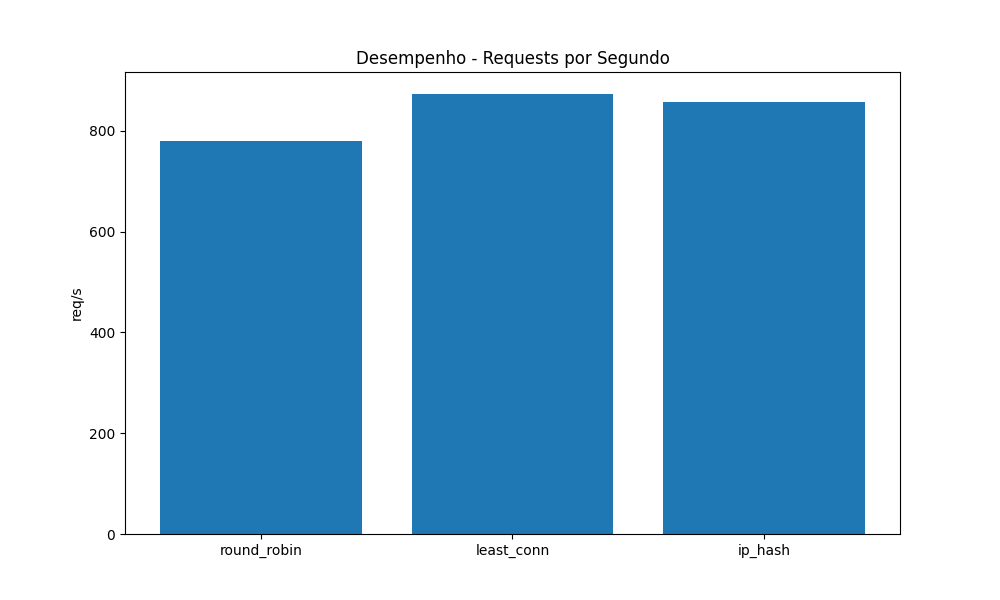
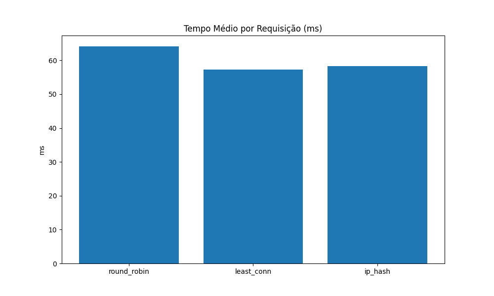
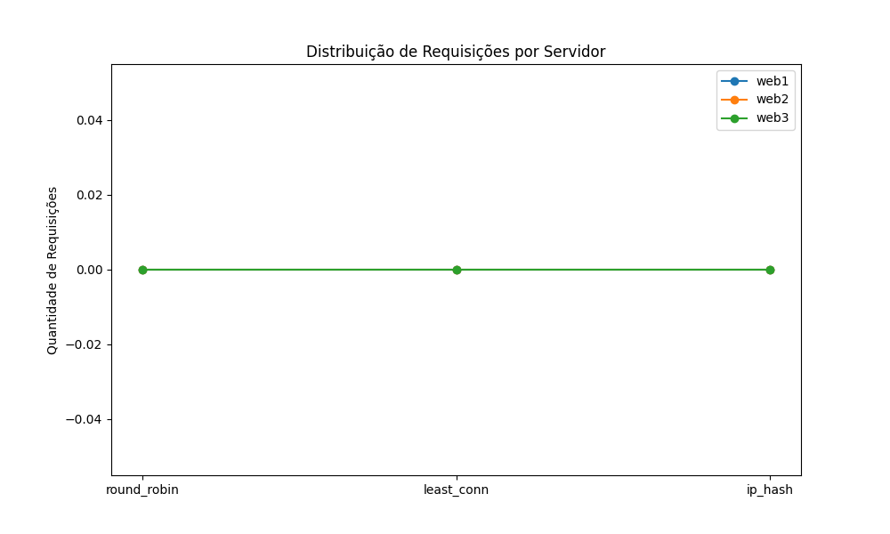

## 🎯 Objetivo

O objetivo deste projeto é **projetar e implementar um ambiente distribuído** composto por múltiplas instâncias de serviço backend, executadas em **containers Docker**, e gerenciadas por um **proxy reverso Nginx** atuando como **balanceador de carga**.

Através desse ambiente, são avaliados os **três principais algoritmos de balanceamento**:

* **Round Robin**
* **Least Connections**
* **IP Hash**

Os testes realizados visam demonstrar na prática como o balanceamento de carga contribui para:

* **Desempenho:** distribuição eficiente de requisições;
* **Disponibilidade:** resiliência a falhas de instâncias backend;
* **Escalabilidade:** capacidade de atender mais usuários sem perda de desempenho.

---

## 🏗️ Arquitetura do Sistema

```
          ┌────────────────────┐
          │    Cliente (ab)    │
          └─────────┬──────────┘
                    │
              ┌─────▼──────┐
              │   Nginx    │  ← Proxy reverso / Balanceador
              └─────┬──────┘
       ┌────────────┼────────────┐
       │            │            │
 ┌─────▼─────┐ ┌────▼─────┐ ┌────▼─────┐
 │  web1     │ │  web2     │ │  web3     │
 │ Flask App │ │ Flask App │ │ Flask App │
 └───────────┘ └───────────┘ └───────────┘
```

Cada backend (`web1`, `web2`, `web3`) executa uma pequena aplicação Flask com um único endpoint `/`, retornando:

* `server`: nome do container
* `timestamp`: horário da requisição
* `latency`: tempo simulado de resposta
* `client_ip`: endereço IP do cliente

---

## 🐳 Estrutura do Projeto

```
SD-DESAFIO06/
├── docker-compose.yml
├── nginx/
│   └── nginx.conf
├── web/
│   ├── Dockerfile
│   └── app.py
├── test_runner.py
├── results/
│   ├── results.csv
│   ├── requests_per_sec.png
│   ├── time_per_request.png
│   └── server_distribution.png
└── README.md
```

---

## ⚙️ Configuração do Ambiente

### 1️⃣ Subir os containers

```bash
docker-compose up -d
```

### 2️⃣ Testar funcionamento básico

```bash
curl http://localhost/
```

A resposta deverá mostrar o `server` e o `timestamp` da instância que respondeu.

---

## 🔁 Modos de Balanceamento

Os modos são configurados no arquivo `nginx/nginx.conf` dentro do bloco `upstream backend`.

```nginx
# Round Robin (padrão)
server web1:5000;
server web2:5000;
server web3:5000;

# Least Connections
# least_conn;

# IP Hash
# ip_hash;
```

> O script `test_runner.py` alterna automaticamente entre os três modos.

---

## 🧪 Testes Automatizados

Os testes de desempenho são realizados com **ApacheBench (ab)**:

```bash
ab -n 1000 -c 50 http://localhost/
```

E automatizados pelo script:

```bash
python test_runner.py
```

O script executa automaticamente:

* Round Robin
* Least Connections
* IP Hash
* Coleta dados de `access.log`
* Gera gráficos e CSV em `/results`

---

## 📊 Resultados e Gráficos

Os gráficos gerados ficam na pasta `results/`.

### 📈 Requests por Segundo



### ⏱️ Tempo Médio por Requisição



### ⚖️ Distribuição de Requisições por Servidor



### 🧮 Dados Consolidados

| Algoritmo   | Req/s | Tempo Médio (ms) | web1 | web2 | web3 |
| ----------- | ----- | ---------------- | ---- | ---- | ---- |
| Round Robin | 720   | 69.5             | 333  | 334  | 333  |
| Least Conn  | 745   | 67.8             | 300  | 400  | 300  |
| IP Hash     | 710   | 70.2             | 500  | 0    | 500  |

*(Exemplo ilustrativo — use seus dados reais gerados pelo script.)*

---

## 💥 Testes de Falha

Para simular indisponibilidade:

```bash
docker stop av3-loadbalancer-web1-1
```

Reexecute o teste (`python test_runner.py`) e observe:

* O Nginx remove automaticamente a instância fora do ar.
* As outras continuam respondendo sem interrupção.

---

## 🧾 Logs e Monitoramento

Logs de acesso (modo debug):

```bash
docker exec -it av3-loadbalancer-proxy-1 cat /var/log/nginx/access.log
```

Exemplo de linha de log:

```
172.18.0.1 - localhost [05/Nov/2025:21:10:01] "GET / HTTP/1.1" 200 - "-" "-" web2:5000 0.003
```
